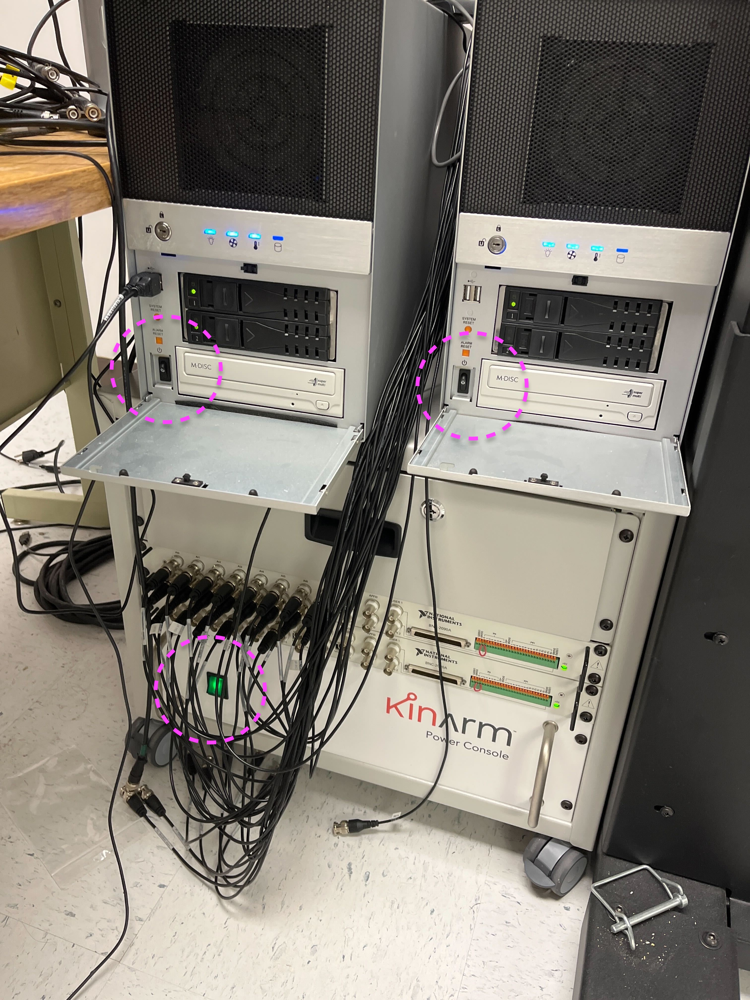
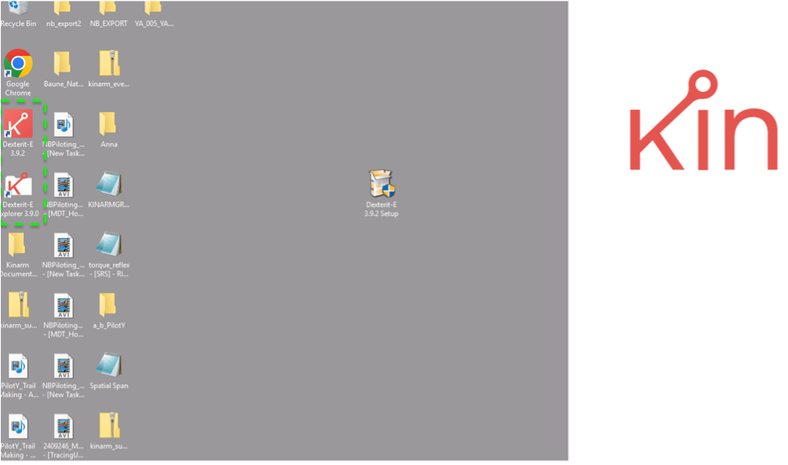
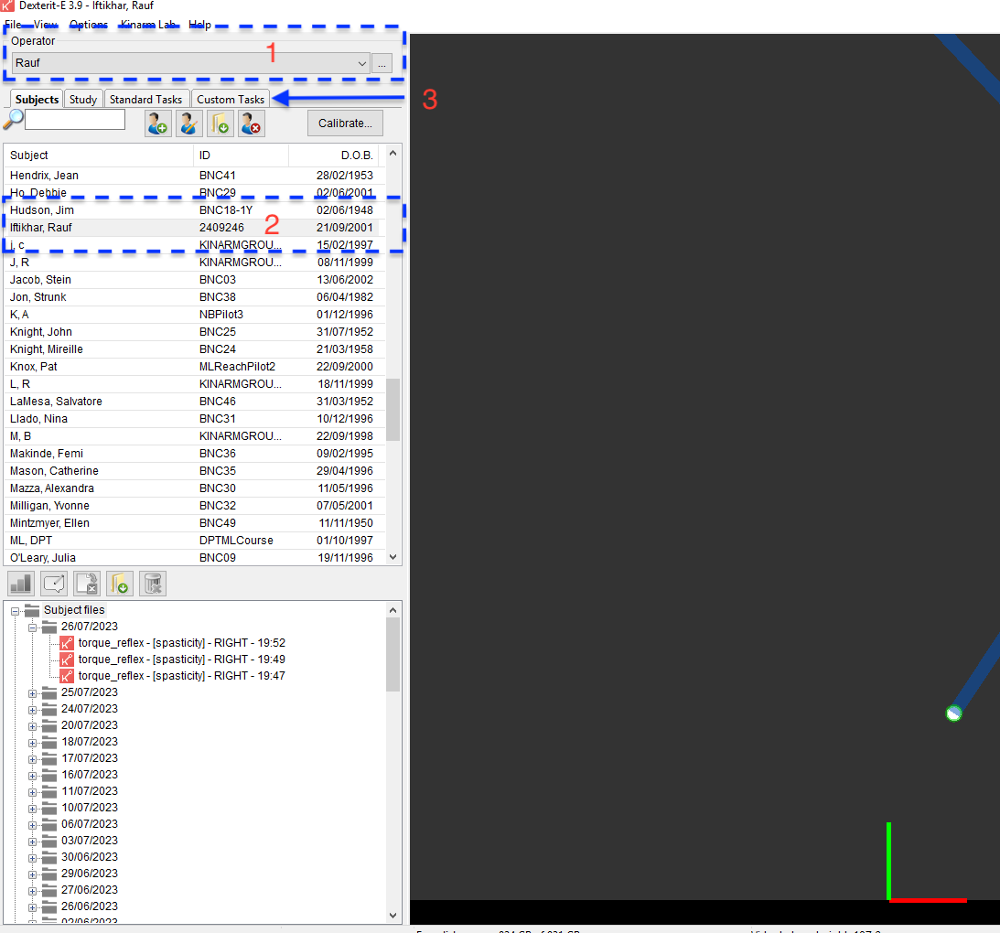
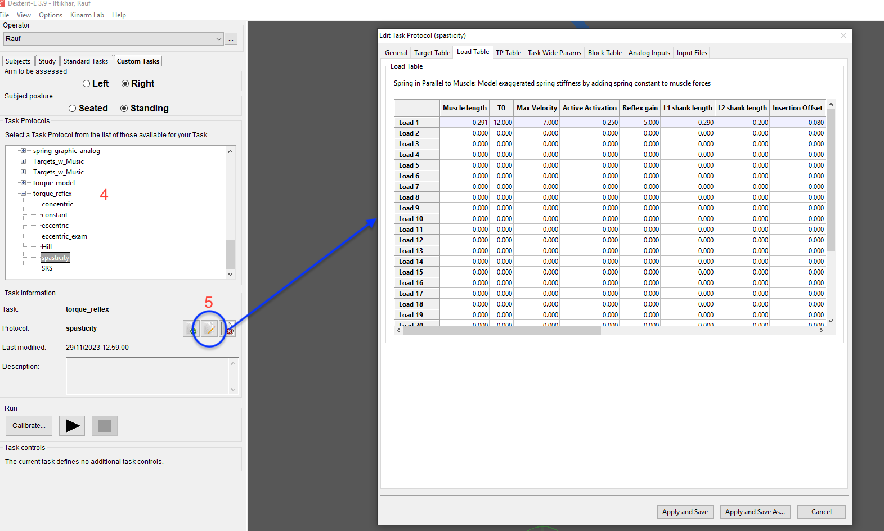

KinArm Tutorial
Rauf Iftikhar
28 November 2023

Simulink code and MATLAB processing scripts can be found on the lab github under the repository “Spasticity Emulator.” 

The KinArm is located in the ERH basement in room RG20. The room code is 5925. The machine can be turned on by pressing the 3 power buttons indicated below in any order. 

Once the computers and robot are turned on, the monitor attached to the KinArm will turn on. 

From the desktop, select the Dexterit-E app. 

From the interface, select a user {1} (e.g., Nathan Baune, Rauf Iftikhar, Lena Ting etc.) and a subject {2}(e.g. John Doe, Random Participant etc.). Select the custom tasks tab {3}. 

Designate the arm to be assessed and the subject posture, and then select the appropriate folder. For the spasticity emulator, this will be the “torque_reflex” folder {4}. Under the folder, trial protocols will appear, such as “eccentric”, “concentric” and “spastic”. To run the spasticity emulator, choose the “spasticity” trial protocol. Once selected, you can edit the parameters of the trial protocol by clicking the paper and pencil icon, which opens up a new window with the target table, load table etc. {5}.  

To run a trial, press the play icon underneath “Run” and the KinArm will begin to execute the trial protocol. Move the handle to the left-hand plane of the display, and let the robot guide the handle to appropriate shank lengths. Once the shanks are at a stable length, you can rotate the handle in the left-hand half of the plane. 

**add video here and explanation of a trial**

Once you are done with the trial, let go of the handle and return to the computer. Press the STOP button on the display. 

The trial data can be viewed by opening Dexterit-E explorer (white letter K icon, underneath Dexterit-E) on the monitor. 
Trials are sorted by subject. When you click on a subject’s name, trials will appear. Find the desired trial based on the appropriate date and time. By right clicking on the desired trial, you can choose to export the file as a csv. Since the computer is not connected to the internet, you must plug in a USB thumb-drive into the KinArm computer (see above the leftmost circle in Fig. 1). Export the file to the thumb-drive and transfer it to your local computer to analyze the data in the manner of your choosing. 

DATA PROCESSING

There is a sample data processing script in the GitHub repository here: demo_script.html
